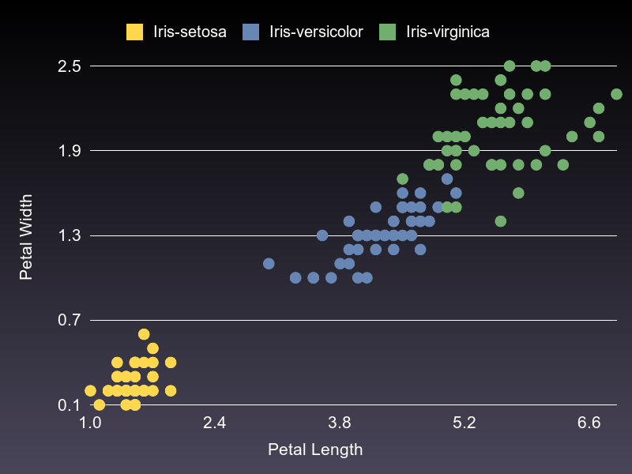

# Charty - Visualizing your data in Ruby

## RubyConf Taiwan 2019

<br>

### @284km
### Kazuma Furuhashi

<br>

### Speee Inc. 

---
- I came to Taiwan and spent 3 days
- Taiwan is a excellent place. Everything I ate was delicious
- I love taiwan
---
## I ate Gyoza, xiaolongbao, delicious soups, noodles(forgot the name...) and loved them.

---
## I went to 龍山寺

There are many other places I would like to go, but I will not calm down until the presentation is over :)

I'm looking forward to it.

- 九份
- 象山
- 猫空
- etc ...

<!-- Comments (for presenter note) -->
<!--
To keep a compatibillity with general markdown document, we're using HTML
comments to be realize the presenter note of slide deck.
-->

---

- By the way I came from Japan Tokyo

---

<center>

</center>

---
- I came from asakusa.rb
- I'm a member of Asakusa.rb
- If you ever come to Japan, come to Asakusa.rb
---
# Bubble tea

- Recently very popular in Japan.
- But I drank bubble tea for the first time in Taiwan
- Thank you Stan(@\_st0012). He is very kind. He guided me to bubble tea
- I drink different taste every day
- It's taste terrific. I love it. I love this tea.

---

# Tea

- I'm interested in teas other than "Bubble" tea.
- I wanna go to 猫空. and I wanna get delicious tea.
- By the way, tea is pronounce in Chinese and Japanese. 茶(cha)

---
# 茶(cha)

---
# :tea: is 茶(cha)
---
# 茶 is :tea: ?
---
# 茶 is `:tea:` ?
---
# 茶 and `:tea:` ?
---
# ......!!!
---
# "Charty"

[red-data-tools/charty](https://github.com/red-data-tools/charty/tree/master/examples)

---

So today I wanna introduce abount Charty.

---
# About Charty

- Charty is a open-source Ruby library for visualizing your data in a simple way.
- For example such a graph, such a graph, or such a graph or something like this, etc.
- We can easily plot with Charty

  

---
# Characteristics of Charty

- Charty has 2 abstract layer
  - Data Abstraction Layer
  - Plotting Abstraction Layer
- (I will explain later)

---
# Basic usage of Charty

(demo)

/examples/iris_dataset.ipynb

---

# This is basic usage

Next, focus on the code we need to write.

---

# Pyplot

```
require 'charty'
charty = Charty::Plotter.new(:pyplot)

scatter = charty.scatter do
  iris.group_by(:label).groups.each do |label, index|
    records = iris.row[*index]
    series records[:petal_length].to_a, records[:petal_width].to_a, label: label[0]
  end
  xlabel "Petal Length"
  ylabel "Petal Width"
end

scatter.render('pyplot.png')
```

---

# Gruff

```
require 'charty'
charty = Charty::Plotter.new(:gruff)

scatter = charty.scatter do
  iris.group_by(:label).groups.each do |label, index|
    records = iris.row[*index]
    series records[:petal_length].to_a, records[:petal_width].to_a, label: label[0]
  end
  xlabel "Petal Length"
  ylabel "Petal Width"
end

scatter.render('gruff.png')
```

---

# Plotting Abstraction Layer

- The difference is one line.
- Here is one of the features of Charty
- We can easily switch back-end libraries with almost the same code
- e.g.) left: Pyplot, right: Gruff

 

---

## More about Plotting Abstraction Layer

- Currently supported backends
    - pyplot
    - gruff
    - Rubyplot
    - google-chart
    - bokeh
    - plotly
    - plotly.js
    - chart.js

---

# About each backend

- I feel that Pyplot has the largest number of graph types that can be output.
- When we want to add a graph to support, we often implement Pyplot first as a reference implementation.
- After that, we will implement other libraries.

---

# Other cases about backend

- For example, google-charts, bokeh, plotly
- These were implemented by a pull request that "I'd like to use if this library is supported by the back end of Charty"
- If there is a real User and Real-world use case exists, it depends on the priority with other work, but consider support for a new backend. At the moment we are developing that way

---

# (Next, but If time seems to be ...)

# Do you know ...?

---

# Ruby Association Grant

Charty is a project of [Ruby Association Grant 2018](https://www.ruby.or.jp/en/news/20181106)

[this is my proposal at the time](https://gist.github.com/284km/0d451d9f6a491f1d839ab8a9ad8f4fe2)

If you are interested, You may wish to apply for the Ruby Association Grant 2019 :) (Application for 2019 has not started yet)

---

# Data Abstraction Layer

- daru
- numo/narray
- nmatrix
- ActiveRecord

(demo)

Thus, it can respond to various data structures.
That's because Charty::Table is abstracted.

---

# Feature summary of Charty

- Charty has two abstraction layers.
    - Data Abstraction Layer
    - Plotting Abstraction Layer.
- So we can use the data structures we need
- We can use output libraries we want to use.

---

# Introduction of various use cases

- The examples so far have mainly introduced back-ends that output graph images.
- Recently, we introduced Charty in our production environment of Web Application, which is our job.
- This Web Application is a common Rails Application.
- At that time, we were asking for Charty to output json, not the image.
- Here is an example using plotly.js (demo)

---

# Code

```
# controller
plotlyjs = Charty::Plotter.new(:plotlyjs)
plotlyjs.table = DataModel.new(params[:foo])
json_data = plotlyjs.to_json
layout_data = plotlyjs.layout

# view
<div id="sample"></div>

# javascript
import * as Plotly from 'plotly.js-dist';
Plotly.newPlot("sample", json_data, layout_data);
```

---

# Another sample Chart.js

this is another sample application using Chart.js as a Charty backend.
this case, Charty returns HTML includes javascript code to need.

This is an experimental implementation, but I would like to have features abstracted according to the use case.

---

## https://github.com/284km/benchmark_driver-output-charty

There is another thing that I tried to use differently.

---

# benchmark-driver

ruby/csv benchmark-driver

```
$ gem install 
$ benchmark-driver examples/parse.yaml

Calculating -------------------------------------
                      csv 3.1.1   csv 3.0.1
            unquoted     61.332      38.149 i/s -     100.000 times in 1.630461s 2.621311s
              quoted     30.558      17.023 i/s -     100.000 times in 3.272469s 5.874313s
               mixed     40.932      23.047 i/s -     100.000 times in 2.443082s 4.339030s
     include_col_sep     11.167      10.657 i/s -     100.000 times in 8.955275s 9.383878s
     include_row_sep     11.180       4.339 i/s -     100.000 times in 8.944608s 23.044523s
        encode_utf-8     39.129      31.525 i/s -     100.000 times in 2.555671s 3.172112s
         encode_sjis     49.982      31.289 i/s -     100.000 times in 2.000736s 3.196026s

Comparison:
                         unquoted
           csv 3.1.1:        61.3 i/s
           csv 3.0.1:        38.1 i/s - 1.61x  slower

                           quoted
           csv 3.1.1:        30.6 i/s
           csv 3.0.1:        17.0 i/s - 1.80x  slower

                            mixed
           csv 3.1.1:        40.9 i/s
           csv 3.0.1:        23.0 i/s - 1.78x  slower

                  include_col_sep
           csv 3.1.1:        11.2 i/s
           csv 3.0.1:        10.7 i/s - 1.05x  slower

                  include_row_sep
           csv 3.1.1:        11.2 i/s
           csv 3.0.1:         4.3 i/s - 2.58x  slower

                     encode_utf-8
           csv 3.1.1:        39.1 i/s
           csv 3.0.1:        31.5 i/s - 1.24x  slower

                      encode_sjis
           csv 3.1.1:        50.0 i/s
           csv 3.0.1:        31.3 i/s - 1.60x  slower

```

---

# csv

https://slide.rabbit-shocker.org/authors/kou/rubykaigi-2019/

---

- Data Abstraction Layer (currently supports)
    - Array
    - Hash
    - daru
    - numo-narray
    - nmatrix
    - ActiveRecord
    - benchmark_driver (Charty Adapter)
- It can Output: image, HTML, JSON

---

# Last thing

---

# Future plan

- Interface
- Release stable version
- Support red-arrow
- Improve iruby
- more faster csv
- Add supported dataset (red-datasets) (e.g. titanic)

---

## Join us! && Have fun!

Thanks alot! and see you at the After Hack event

