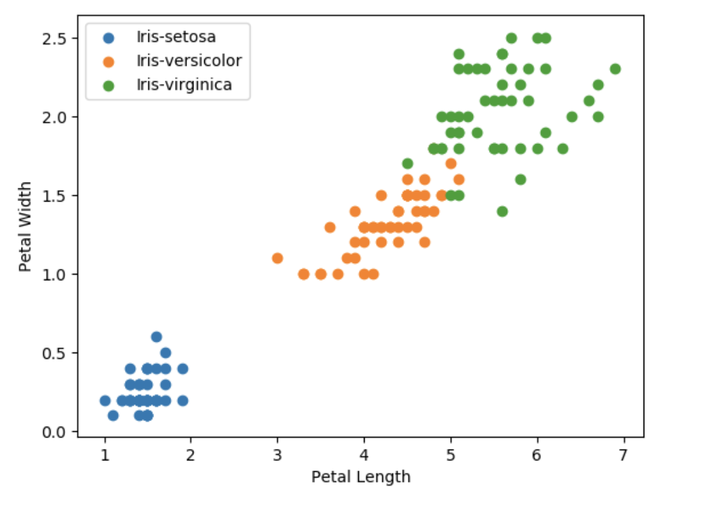
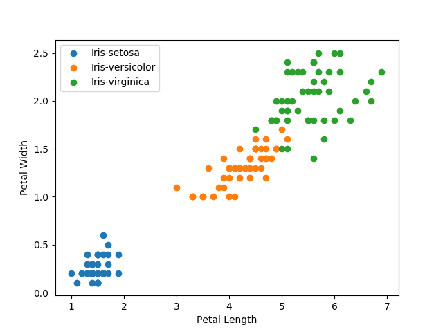
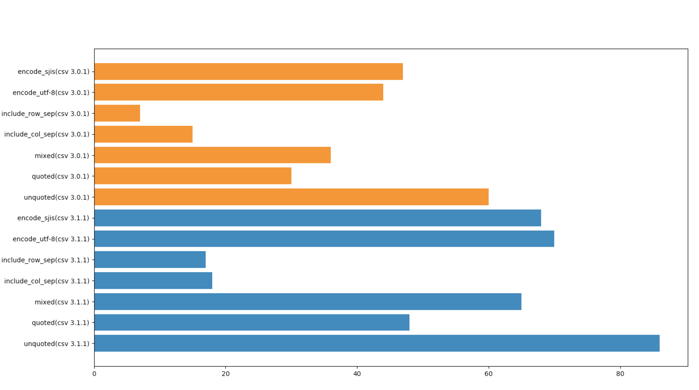

## RUBYCONFTH :tada:

<br>

## Charty - Visualize Real-world Data with Ruby

<br>
<br>

### @284km (Kazuma Furuhashi)

### Speee Inc. 

---

## RUBYCONFTH :tada:

I came to Thailand for the first time.

I've wanted to see the Chao Phraya River. I was able to achieve it yesterday.

Thank you for holding the RubyConfTH

   

---

# about me (@284km)

- a programmer
- came from Japan, Tokyo
- I made Ruby2.6 standard CSV library 1.5x-3x faster
- a creator of a visualization library named Charty
- a member of Asakusa.rb

---

If you ever come to Japan, come to Asakusa.rb

<center>

</center>

---

## Btw, what langage do you use?

Ruby? Java? Python? JavaScript?

English? Thai? Japanese?

or many other languages?

---

## I often write Ruby, but speaking language is not Ruby.

---

## I recently learned some interesting things common to English, Thai and Japanese.

---

## I think these are similar pronunciations

- Shopping (ʃάpɪŋ)
- ช้อปปิ้ง (cʰɔ́ɔp pîŋ)
- ショッピング(shoppingu)

---

## There are similar

- online (ɔ́nlàɪn)
- ออนไลน์ (ɔɔn lai)
- オンライン (onrain)

---

## There are also similar

- donut (dóʊn`ʌt)
- โดนัท (doo nát)
- ドーナツ (Dōnatsu)

---

## are these similar?

- :tea: (`:tea:`)
- 茶 (cha)
- ชา (cʰaa)
- tea (tíː)

---

## :tea: (cʰaa) is pronounced :tea: (tíː)
## :tea: (cʰaa) is :tea: (tíː)

- ชา (cʰaa)
- tea (tíː)

---

## ชา tea
## :tea: :tea:

...!! do you know?

---

## ชา tea
## :tea: :tea:

# "Charty"

[red-data-tools/charty](https://github.com/red-data-tools/charty/tree/master/examples)

So today I would like to talk about Charty.

---

# About Charty

- Charty is a open-source Ruby library for visualizing your data in a simple way.
- For example, Charty outputs these graphs.
- We can easily plot using Charty

  

---

## Charty using Ruby, Java, Python and JavaScript.

- These days, there is no de facto standard visualization tool for Ruby
- On the other hand, each above languages has its own good plotting library
- Thus, Charty is visualizing your data by standing on the shoulders of giants

---

# Characteristics of Charty

- Charty has 2 abstract layer
  - Data Abstraction Layer (abstract data structure)
  - Plotting Abstraction Layer (abstract backend plotting libraries)
- (I will explain about it later)

<center>

</center>

---

# This is basic usage of Charty

(I will show a demo)

/examples/iris_dataset.ipynb

---

# Next, focus on the code we need to write.

---

## This is output images
## How code we need to write?

 

---

# e.g. Pyplot backend

```
require 'charty'
charty = Charty::Plotter.new(:pyplot)

scatter = charty.scatter do
  iris.group_by(:label).groups.each do |label, index|
    records = iris.row[*index]
    series records[:petal_length].to_a, records[:petal_width].to_a, label: label[0]
  end
  xlabel "Petal Length"
  ylabel "Petal Width"
end

scatter.render('pyplot.png')
```

---

# Gruff backend example

If we want to use another backend, difference is only one line.

```
require 'charty'
charty = Charty::Plotter.new(:gruff)

scatter = charty.scatter do
  iris.group_by(:label).groups.each do |label, index|
    records = iris.row[*index]
    series records[:petal_length].to_a, records[:petal_width].to_a, label: label[0]
  end
  xlabel "Petal Length"
  ylabel "Petal Width"
end

scatter.render('gruff.png')
```

---

## about Plotting Abstraction Layer

<center>

</center>

---

## about Plotting Abstraction Layer

- From the previous example, the difference is one line to change backend
- Here is one of the features of Charty
- We can easily switch backend libraries with almost the same code

 

---

## More about Plotting Abstraction Layer

- Currently supported backends is below
    - pyplot
    - gruff
    - Rubyplot
    - google-chart
    - bokeh
    - plotly
    - plotly.js
    - chart.js
    - JFreeChart (Charty now works with JRuby :tada:) 

---

# How to develop backend

- I feel that Pyplot has the largest number of graph types that can be output.
- When we want to add a graph to support, we often implement Pyplot first as a reference implementation.
- After that, we will implement other libraries.

---

# (other cases)

- For example, google-charts, bokeh, plotly
- These were implemented by a pull request that "I'd like to use Charty if this library is supported by the backend"
- If there is a real User and Real-world use case exists, it depends on the priority with other work, but consider support for a new backend

---

# about Data Abstraction Layer

<center>

</center>

---

# about Data Abstraction Layer

- Charty supports these data structures (I will show a demo)
    - daru
    - numo/narray
    - nmatrix
    - ActiveRecord

Thus, Charty can respond to various data structures.
That's because Charty::Table is abstracted.

---

# Feature summary of Charty

- Charty has two abstraction layers.
    - Data Abstraction Layer
    - Plotting Abstraction Layer.
- Thus we can use the data structures we need
- We can use output libraries we want to use.
- We can use them in any combination we need with almost no code rewrite.

---

# Introduction of various use cases of Charty

- Recently, we introduced Charty in our production environment of Web Application, which is our job.
- This Web Application is a common Rails Application.
- At that time, we were asking for Charty to output json, not image file.
- Here is an example using plotly.js (I will show a demo)

---

# Code

```
# controller
plotlyjs = Charty::Plotter.new(:plotlyjs)
plotlyjs.table = DataModel.where(foo: bar)
json_data = plotlyjs.to_json
layout_data = plotlyjs.layout

# view
<div id="sample"></div>

# javascript
import * as Plotly from 'plotly.js-dist';
Plotly.newPlot("sample", json_data, layout_data);
```

---

This combination is also possible. Because Charty has Data Abstraction Layer to support various data structures.

## https://github.com/284km/benchmark_driver-output-charty

---

benchmark-driver outputs as below by default.

```
$ gem install 
$ benchmark-driver examples/parse.yaml

Calculating -------------------------------------
                      csv 3.1.1   csv 3.0.1
            unquoted     61.332      38.149 i/s -     100.000 times in 1.630461s 2.621311s
              quoted     30.558      17.023 i/s -     100.000 times in 3.272469s 5.874313s
               mixed     40.932      23.047 i/s -     100.000 times in 2.443082s 4.339030s
     include_col_sep     11.167      10.657 i/s -     100.000 times in 8.955275s 9.383878s
     include_row_sep     11.180       4.339 i/s -     100.000 times in 8.944608s 23.044523s
        encode_utf-8     39.129      31.525 i/s -     100.000 times in 2.555671s 3.172112s
         encode_sjis     49.982      31.289 i/s -     100.000 times in 2.000736s 3.196026s

Comparison:
                         unquoted
           csv 3.1.1:        61.3 i/s
           csv 3.0.1:        38.1 i/s - 1.61x  slower

                           quoted
           csv 3.1.1:        30.6 i/s
           csv 3.0.1:        17.0 i/s - 1.80x  slower

                            mixed
           csv 3.1.1:        40.9 i/s
           csv 3.0.1:        23.0 i/s - 1.78x  slower

                  include_col_sep
           csv 3.1.1:        11.2 i/s
           csv 3.0.1:        10.7 i/s - 1.05x  slower

                  include_row_sep
           csv 3.1.1:        11.2 i/s
           csv 3.0.1:         4.3 i/s - 2.58x  slower

                     encode_utf-8
           csv 3.1.1:        39.1 i/s
           csv 3.0.1:        31.5 i/s - 1.24x  slower

                      encode_sjis
           csv 3.1.1:        50.0 i/s
           csv 3.0.1:        31.3 i/s - 1.60x  slower

```

---

benchmark_driver-output-charty outputs as below.

```
$ benchmark-driver examples/parse.yaml -o charty
```

<center>

</center>

---

## summary of Data Abstraction Layer
- currently supports
    - Array
    - Hash
    - daru
    - numo-narray
    - nmatrix
    - ActiveRecord
    - benchmark_driver (Charty Adapter)
- It can output: image, HTML, JSON format

---

# Now Charty with JRuby is working

<br>

<center>

</center>

This impression became my motivation.
So, I implemented JFreeChart backend.
Thanks to Charles, development progressed.

---

# Charty with JRuby

[red-data-tools/charty-backends-jfreechart](https://github.com/red-data-tools/charty-backends-jfreechart)

Please use JRubyist.
This is not yet complete.
If you have important use cases, I can write code.
I'm grad to hear everyone's thoughts.

---

# Future plan (we aim for these)

- Improvement interface (Continued)
- Support red-arrow for Data Abstraction Layer
    - because Apache Arrow is great.
- Release stable version
- Add supported dataset (red-datasets) (e.g. titanic)

---

## We code && Have fun!

If you are interested in Charty, feel free to talk me.

Thank you!

