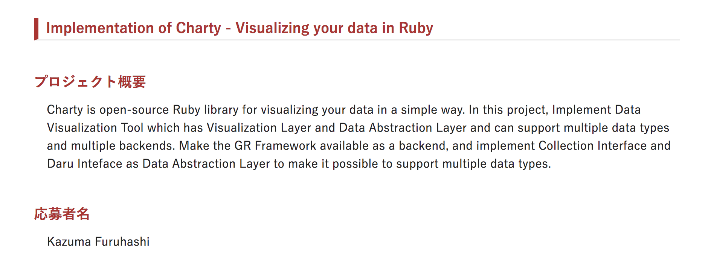

# Ruby Association Grant 2018 Report

<br>

```
Charty.new( "Visualizing your data in Ruby" ) |> Grant |> RubyKaigi |> Latest |> render
```

<br>
<br>

### @284km (Kazuma Furuhashi)

### Speee Inc. 

---

## はじめての pipeline operator

<br>

```
Charty.new( "Visualizing your data in Ruby" ) |> Grant |> RubyKaigi |> Latest |> render
```

<br>

---

### [Revert "Add pipeline operator [Feature #15799]" · ruby/ruby@2ed68d0](https://github.com/ruby/ruby/commit/2ed68d0ff9a932efbc4393c869534040dec8f647)

<br>

<strike>
Charty.new( "Visualizing your data in Ruby" ) |> Grant |> RubyKaigi |> Latest |> render
</strike>

<br>

僕が発表タイトルを提出した頃の trunk では動いてた

<br>

---

# Ruby Association Grant 2018 Report

<br>

<strike>
Charty.new( "Visualizing your data in Ruby" ) |> Grant |> RubyKaigi |> Latest |> render
</strike>

```
Charty.new( "Visualizing your data in Ruby" ).Grant.RubyKaigi.Latest.render
```

<br>
<br>

### @284km (Kazuma Furuhashi)

### Speee Inc. 

---

# about me / what I did

- @284km
- **[red-data-tools/charty](https://github.com/red-data-tools/charty)** 成果報告
- ( [Red Data Tools](https://red-data-tools.github.io/), [Asakusa.rb](https://asakusarb.esa.io/), [Speee](https://speee.jp/) )

---

# [Rubyアソシエーション開発助成金2018 公募開始](https://www.ruby.or.jp/ja/news/20180801)

応募 -> 採択



応募した時の内容をこちらに公開しています。

https://gist.github.com/284km/0d451d9f6a491f1d839ab8a9ad8f4fe2

---

# About [Charty](https://github.com/red-data-tools/charty)

- Charty is a open-source Ruby library for visualizing your data in a simple way.
- For example, Charty outputs these graphs.
- We can easily plot using Charty

  

---

# Why Charty?

- Ruby には可視化ツールの定番と言えるものが存在しないと言えるだろう。
- 様々な理由（後ほど説明するが、存在しない分野のツールを今から用意するのは大変という理由）があるので Ruby 用の可視化ツールを作るのは難しいのだが、Charty の思想はその分野の初手として妥当で、やる意味もあると思えていた。
- 他言語であっても、優れたライブラリがあるのならばそれををまず Ruby から使えるようにして、まず Ruby で使える可視化ツールを用意しようという方向性です（後ほど説明します）

---

# なお、この時点での自分の状態はこの程度でした

- 応募した時点ではまだよくわかっていないことは多かった
- どうやったら完成できるのかも明確には分かっていなかった
- 達成するためにどの程度の調査が必要になるのかが読めなかった辺りは大きめの不安材料だった
- まあ、不明点や、不足する前提知識は補いながら進めればよいという考えではじめた

---

# The scope in Grant is as follows

- (1) Create a thin Ruby library that can use the GR framework as an independent backend.
- (2) Enable GR framework as backend from Charty (use SciRuby/rubyplot as the visualization layer)
- (3) Implements Collection Interface corresponding to Charty's Data Abstraction Layer.
- (4) Implement Daru Interface corresponding to Charty's Data Abstraction Layer.

<br>

そして中間報告の時点で、以下 2 つの実装を余力があれば実施すると加えた

- (a) Support rubydown (https://github.com/sciruby-jp/rubydown)
- (b) Support ActiveRecord Interface

---

# Characteristics of Charty

- Charty has 2 abstract layer
  - Data Abstraction Layer (abstract data structure)
  - Plotting Abstraction Layer (abstract backend plotting libraries)
- (I will explain about it later)

<center>

</center>

---

# Basic usage

Charty とはこういうものです。

<br>

(I will show a demo)

/examples/iris_dataset.ipynb

---

## 開発を進めると、当初の目論見どおり行かないことも発生します

- GR フレームワークとそれを利用する Ruby 向け可視化ライブラリである rubyplot の開発状況が
予想よりも進んでいなかった
- rubyplot の他に、Python の可視化ライブラリである matplotlib を pycall.rb を介して利用し、同時に複数の可視化ライブラリのバックエンドをサポートする事を目指すように方針転換した
- 中間報告までに Plotting Abstraction Layer の仕組みを用意することを目指していたが、報告時には matplotlib と rubyplot の他に Gruff をバックエンドとしてサポートすることができた

---

# Next, focus on the code we need to write.

---

## This is output images
## How code we need to write?

 

---

# e.g. Pyplot backend

```
require 'charty'
charty = Charty::Plotter.new(:pyplot)

scatter = charty.scatter do
  iris.group_by(:label).groups.each do |label, index|
    records = iris.row[*index]
    series records[:petal_length].to_a, records[:petal_width].to_a, label: label[0]
  end
  xlabel "Petal Length"
  ylabel "Petal Width"
end

scatter.render('pyplot.png')
```

---

# Gruff backend example

If we want to use another backend, difference is only one line.

```
require 'charty'
charty = Charty::Plotter.new(:gruff)

scatter = charty.scatter do
  iris.group_by(:label).groups.each do |label, index|
    records = iris.row[*index]
    series records[:petal_length].to_a, records[:petal_width].to_a, label: label[0]
  end
  xlabel "Petal Length"
  ylabel "Petal Width"
end

scatter.render('gruff.png')
```

---

## about Plotting Abstraction Layer

<center>

</center>

---

## about Plotting Abstraction Layer

- From the previous example, the difference is one line to change backend
- Here is one of the features of Charty
- We can easily switch backend libraries with almost the same code

 

---

## More about Plotting Abstraction Layer

- Currently supported backends is below
    - pyplot
    - gruff
    - Rubyplot
    - --- 最終報告時点 ---
    - google-chart (@indigolain)
    - bokeh (@kantarow)
    - plotly (@kei-s)
    - plotly.js
    - chart.js
    - JFreeChart (for JRuby)

---

# Plotting Abstraction Layer 実装時のポイント

- 出力可能なグラフの種類が一番多い Matplotlib をリファレンス実装として、その後他のライブラリのサポートを増やしつつ Interface を考えるという手順で作業を進めた。

- サポートするグラフの種類により描画に必要なデータ構造が異なるため、より多くのグラフ出力に対応した Interface を考えるにあたってはこの手順が有効であった。

- 当初、GR Framework を backend に持つ rubyplot が魅力的であり真っ先に実装を始めたが、それに続いて Matplotlib のサポートを考えると両ライブラリに対応すること、より多くのグラフ(データ構造)に対応することを同時に考えることとなり難易度が高かったが、村田メンターの助言により順序を変えることで設計の難易度を下げることが出来た。

---

# 中間報告以降(2019/1 中旬) 〜

---

# about Data Abstraction Layer

<center>

</center>

---

# about Data Abstraction Layer

- Charty supports these data structures (I will show a demo)
    - daru
    - numo/narray
    - nmatrix
    - ActiveRecord
    - Array
    - Hash
    - --- 最終報告時点 ---
    - benchmark_driver (Charty Adapter)
    - DataSets

Thus, Charty can respond to various data structures.
That's because Charty::Table is abstracted.

---

# Data Abstraction Layer 実装時のポイント

- Charty がサポートするデータ構造は複数あるため、各データ構造から一度中間データ構造に変換し、その中間データ構造と Plotting Abstraction Layer とのマッピング処理を用意することにより、新たなデータ構造をサポートしたい場合には中間データ構造にさえ対応するコードを書けばよいという状態をまず作った。
- その中間データ構造が Charty::Table (この後説明します)
- この点では Charty と思想の近い [holoviews](https://github.com/pyviz/holoviews) の Interface を参考にした。
- 機能の拡充と共に Charty::Table の役割は増えるため、ある程度複雑になる時点で対応するデータ構造に応じた Adapter を用意することを予定している。(Grant の開発期間後に adapter の仕組みを実際に用意した)

---

# Charty::Table

### [村田メンターのメンター報告書](https://www.ruby.or.jp/grant/2018/grant2018-charty-mentor.pdf) の説明が非常にわかりやすい

- 可視化をする対象となるデータは tidy data 形式 (または、整然データ形式) と呼ばれる表形式にまとめられることが多い。
- Charty は、論理的に表として解釈可能な様々なデータ構造を Charty::Table クラスで包むことで、データ構造の実装の詳細を可視化レイヤから隠すことを目指している。
- 本プロジェクトでは、このデータ構造の詳細を隠すためのデータ抽象化レイヤを開発するために、holoviews を参考にし、Daru::DataFrame、Numo::NArray、ActiveRecord の関係データを抽象化することに対応した。

---

# Feature summary of Charty

- Charty has two abstraction layers.
    - Data Abstraction Layer
    - Plotting Abstraction Layer.
- Thus we can use the data structures we need
- We can use output libraries we want to use.
- We can use them in any combination we need with almost no code rewrite.

[こちらが提出した最終報告書](https://www.ruby.or.jp/grant/2018/grant2018-charty.pdf)

---

# Grant 期間の開発 〜 RubyKaigi へと続くことができた

- Charty は特に、他言語の可視化ツールの調査や、インターフェイスを決めるために学習が必要なことが多かったと感じている。
- たとえば Grant に採択されず、中間報告、最終報告といった期限も無いまま Charty の開発を進めていたら、作業はしただろうけれど、いつ形になっていたかというのが今考えてもわからない。ずっと事前準備をしていた恐れすらあると思う。
- 採択して頂き、その課程を経たことにより、RubyKaigi で話せるところまで、この期間で開発を進めることができたという事実がある。
- そして RubyKaigi で RubyData Workshop セッションを企画し、発表機会を提供してくれた村田メンターに感謝している。

---

# RubyKaigi での発表

- Charty の紹介はもちろんだが、一緒に開発する仲間を増やすという目的にフォーカスした。
- 現時点での知識不足は開発をしながら補うことができる点を伝えたかった。これは自分の経験は事実なので伝えることができた。
- Charty のできることをなるべくわかりやすく伝えることを意識した。
- 結果的に、RubyKaigi 期間中に 5 人の方から合計 5 つの PR が作られマージされた。これはうれしい。
- 発表後声をかけてくれた方々とすぐに Hack space に移動して作業開始できたり、コード懇親会で Charty テーブルを作って頂くことができた点などにとても助けられた。このようなサポートのお陰で開発が進んだ事実も広くしられてほしいとも思う。

---

## 名古屋Ruby会議02 〜 RubyConf Taiwan 〜 RubyConfTH

Grant 期間の成果として Charty が動く形で見せられるようになったため、
名古屋Ruby会議02, RubyConf Taiwan, RubyConfTH と海外の Ruby カンファレンスも含め登壇する機会が得られた。

- Charty をより多くの方に知ってもらう機会
- 海外のカンファレンスで登壇するという経験
- 台湾のコード懇親会でも Charty の開発に参加してくれる人が現れ、その PR はマージされた

---

# Now Charty with JRuby is working

<br>

<center>

</center>

This impression became my motivation.
So, I implemented JFreeChart backend.
Thanks to Charles, development progressed.

---

Charty が JRuby に対応したのは RubyConf Taiwan での発表後に頂いた Charles からのこのメッセージがキッカケであるように、海外カンファレンスでも変わらず、発表と開発の良いループを回すことが出来たのは非常に良い経験となった。この経験は今後にも活かしたい

---

# Charty with JRuby

[red-data-tools/charty-backends-jfreechart](https://github.com/red-data-tools/charty-backends-jfreechart)

Please use JRubyist.
This is not yet complete.
If you have important use cases, I can write code.
I'm grad to hear everyone's thoughts.

---

# Other cases

- For example, google-charts, bokeh, plotly
- These were implemented by a pull request that "I'd like to use Charty if this library is supported by the backend"
- If there is a real User and Real-world use case exists, it depends on the priority with other work, but consider support for a new backend

---

# RubyConfTH 〜 つい最近

---

# benchmark_driver との連携

- benchmark_driver は Grant 2017 のプロジェクトで、Ruby のスゴイベンチマークライブラリ
- 実は、この [benchmark_driver の最終報告](https://www.ruby.or.jp/assets/images/ja/news/20180501.data/kokubun.pdf) には、benchmark_driver の活用例として、僕が 2018年3月に沖縄Ruby会議で発表した時の資料が参照されている
- という程度に benchmark_driver ユーザとしてお世話になっているツール
- そこで、benchmark_driver の出力用の Charty プラグインというものを作りました
- 実質 Grant 2 年分の成果とも言えるのではないでしょうか！？

---


This combination is also possible. Because Charty has Data Abstraction Layer to support various data structures.

benchmark_driver plugin to render with Charty

## [benchmark-driver/benchmark_driver-output-charty](https://github.com/benchmark-driver/benchmark_driver-output-charty)


This combination is also possible. Because Charty has Data Abstraction Layer to support various data structures.

---

RubyConfTH での発表から、k0kubun さんが box plot に対応したらよさそうと PR を送ってくれて、ベンチマーク結果を箱ひげ図で出力する機能が最近加わりました。

https://github.com/benchmark-driver/benchmark_driver-output-charty/pull/3


Grant での開発を経て発表機会が生まれ、発表をきっかけに開発がまた進むという良いループが生まれていて、こういう感じにまた次に続くようにしたいなということを最近は考えるようになりました。

---

benchmark-driver outputs as below by default.

```
$ gem install 
$ benchmark-driver examples/parse.yaml

Calculating -------------------------------------
                      csv 3.1.1   csv 3.0.1
            unquoted     61.332      38.149 i/s -     100.000 times in 1.630461s 2.621311s
              quoted     30.558      17.023 i/s -     100.000 times in 3.272469s 5.874313s
               mixed     40.932      23.047 i/s -     100.000 times in 2.443082s 4.339030s
     include_col_sep     11.167      10.657 i/s -     100.000 times in 8.955275s 9.383878s
     include_row_sep     11.180       4.339 i/s -     100.000 times in 8.944608s 23.044523s
        encode_utf-8     39.129      31.525 i/s -     100.000 times in 2.555671s 3.172112s
         encode_sjis     49.982      31.289 i/s -     100.000 times in 2.000736s 3.196026s

Comparison:
                         unquoted
           csv 3.1.1:        61.3 i/s
           csv 3.0.1:        38.1 i/s - 1.61x  slower

                           quoted
           csv 3.1.1:        30.6 i/s
           csv 3.0.1:        17.0 i/s - 1.80x  slower

                            mixed
           csv 3.1.1:        40.9 i/s
           csv 3.0.1:        23.0 i/s - 1.78x  slower

                  include_col_sep
           csv 3.1.1:        11.2 i/s
           csv 3.0.1:        10.7 i/s - 1.05x  slower

                  include_row_sep
           csv 3.1.1:        11.2 i/s
           csv 3.0.1:         4.3 i/s - 2.58x  slower

                     encode_utf-8
           csv 3.1.1:        39.1 i/s
           csv 3.0.1:        31.5 i/s - 1.24x  slower

                      encode_sjis
           csv 3.1.1:        50.0 i/s
           csv 3.0.1:        31.3 i/s - 1.60x  slower

```

---

benchmark_driver-output-charty outputs as below.

```
$ benchmark-driver examples/parse.yaml -o charty
```

<center>

</center>

---

おかげさまでこのように、Charty は開発者が少しずつ増えながら、開発と発表を良い感じに繋げつつ開発する流れができつつあります。

---

### Speee という会社で働いているのですが、あるサービスの production 環境でも Charty が動いています。(production で使われるというのもまた嬉しい成果です)

- Recently, we introduced Charty in our production environment of Web Application, which is our job.
- This Web Application is a common Rails Application.
- At that time, we were asking for Charty to output json, not image file.
- Here is an example using plotly.js (I will show a demo)


---

# Code

```
# controller
plotlyjs = Charty::Plotter.new(:plotlyjs)
plotlyjs.table = DataModel.where(foo: bar)
json_data = plotlyjs.to_json
layout_data = plotlyjs.layout

# view
<div id="sample"></div>

# javascript
import * as Plotly from 'plotly.js-dist';
Plotly.newPlot("sample", json_data, layout_data);
```

---

# Future plan (we aim for these)

- Improvement interface (Continued)
- Support red-arrow for Data Abstraction Layer
    - because Apache Arrow is great.
- Release stable version
- Add supported dataset (red-datasets) (e.g. titanic)
    - 発表を聞いた人が、より興味を持ちやすくなるようなデータで説明できるように
        - 開発者を増やしたいから
- Support Unicode Plot
- Sixel support

---

興味を持った方はぜひ使ってみてください

開発に興味を持った方は一緒に開発しましょう！

---

# Acknowledgement

- Ruby Association Grant
    - Various opportunities
    - My motivation
- @mrkn
    - Great mentor
    - Drawing a Charty concept
- @kou
    - Various implementation advice
- Red Data Tools org and all members
    - All your support
- Speee, Inc
    - Gave me a lot of time and support

