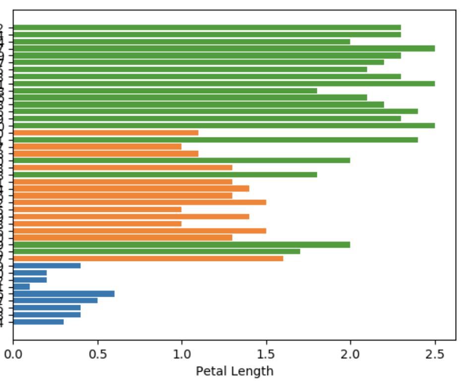
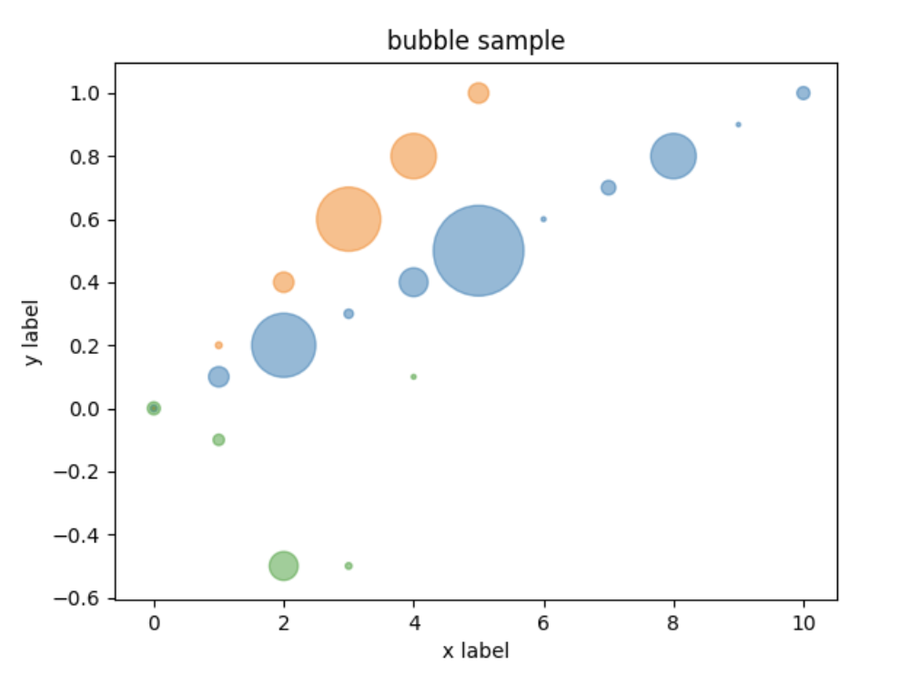

## 第12回フクオカRuby 大賞

<br>

# Charty - Visualizing your data in Ruby
## Red Data Tools 

<br>
<br>

### @284km (Kazuma Furuhashi)
## Speee Inc. 

---

# Charty とは、

## https://github.com/red-data-tools/charty

---

# Charty は、Ruby 用データ可視化ライブラリ

- 少しのコードを書くだけで簡単にデータを可視化できることが特徴
- **ユーザは本来の目的であるデータ分析自体に時間を使いましょう**という考えで作られました。

このような出力を簡単に行うことができます

  

---

# Charty を開発した目的

---

# 想定ユーザー

<br>

## 「データ分析者かどうかにかかわらず、データを可視化したい全ての Rubyists」

<br>

---

# Charty を開発した目的

- 大きくは、Ruby でデータ分析の作業が行える状態を目指している
    - R - もともと統計解析のために作られたプログラミング言語
    - Python - 機械学習に強い。データサイエンスの分野で広く使われている

- データサイエンスの領域で Ruby が十分に使える状態になるためには
    - 必要な道具が揃うこと
    - ユーザが増えること
    - 開発者が増えること

**この 3 つを揃えて、良い循環を生み出して行く必要がある**

---

# 必要な道具・ユーザ・開発者

1 つでも欠けると難しい。全部そろうと希望がある

<center>

</center>

---

# さて、データサイエンスの領域で Ruby が使えるようにしよう

- (なぜ Ruby で？) 普段から使う機会が多く慣れた言語である Ruby でそのままデータ分析ができたら嬉しい。
    - Ruby は 人(プログラマ) の幸せにフォーカス
- それを実現するためにはまず、データ分析作業に必要なツールが存在しなければならない
- データ分析に Ruby が使われることが普通になるためには、少なくないユーザ数も必要
- その為にもまず、普通に使える機能を備えたツールが今必要
- そこで Ruby の可視化ツールである Charty を作りました

---

  

---

# Charty の 3 つのポリシー

1. Ruby 用のライブラリとして自然なつくりになっている事
2. Rubyists が違和感なく使える事
3. Python などで既にデータ可視化をしている人でもスムーズに使い始められる事

**それぞれ、以下を実現するためのものです。**

1. は、Rubyists が Charty の開発に参加しやすくなるため
    => **開発者を増やす**
2. は、多くのユーザーに使ってもらうため
    => **ユーザーを増やす**
3. は、使い分けのコストを最小限にすることで可視化の労力を減らすため
    => **必要な機能を持ち、今使える道具であること**

---

# 必要な道具が揃うということ

- 課題
    - Ruby でデータ分析をしたいと考えた場合、定番と言える可視化ツールが存在しない
    - 分析者各々が可視化のために多くの時間を要するという問題がある
    - 可視化ツールは Ruby でデータ分析作業を行うには足りない機能

- Charty の良い点
    - 動くものをすぐに作り提供したこと
    - 今後の拡張の余地を持たせて提供できたこと

---

# 優位性

- データ分析をする時に Ruby に足りない機能を作ったため、Charty と同じ位置づけでは他に比べる Ruby のツールがありません
- 似た取り組みとしては rubyplot (https://github.com/SciRuby/rubyplot) が存在しますが、こちらは現時点で動かして使える状態には達しておらず、Charty が先に実際に使える機能を提供するに至りました

---

# 2019 年の内にこれらを備えて使える状態で公開したことにまず意味がある

- 動くものをすぐに作り提供した
- 言語問わず良いライブラリは自由な組み合わせで使えるようにする

---

# 動くものをすぐに作り提供した
### 他言語でも優れたツールならば Ruby から使えるようにする

- Python や R に比べると、データ分析に使うツールが揃っていない現状
- 最初からそれらを上回る可視化ツールを作ることを選択していた場合、多くの時間を要する (素晴らしい世界感かもしれないがまだ公開できていなかったかもしれない状況より良い)
- まず今、Ruby で実際に使える可視化ツールが必要であった
- そのために Charty は、Ruby 以外の言語であっても優れたツールならば Ruby(Charty) から使えるようにするという態度で作られた

---

# 実現する仕組み・Charty の抽象レイヤ

他言語でも優れたツールならば使えるようにする

- Data Abstraction Layer
- Plotting Abstraction Layer

<center>

</center>

---

# Data Abstraction Layer

Data Abstraction Layer により、 Charty では統一的にさまざまなデータ構造を扱い、可視化することができます。

- Daru (https://github.com/SciRuby/daru)
- numo/narray (https://github.com/ruby-numo/numo-narray)
- nmatrix (https://github.com/SciRuby/nmatrix)
- ActiveRecord (https://github.com/rails/rails/tree/master/activerecord)
- Array
- Hash
- Red Datasets (https://github.com/red-data-tools/red-datasets/)
- benchmark_driver(plugin) (https://github.com/benchmark-driver/benchmark-driver)
- rbbcc (https://github.com/udzura/rbbcc) 連携進行中！！

---

# Plotting Abstraction Layer

<center>

</center>

---

# Plotting Abstraction Laye

Plotting Abstraction Layer により、 Charty のバックエンドライブラリとして、様々な言語の優れた可視化ライブラリを使い、切り替えることもできます。

- pyplot (https://github.com/matplotlib/matplotlib) Python
- gruff (https://github.com/topfunky/gruff) Ruby
- Rubyplot (https://github.com/SciRuby/rubyplot) Ruby
- google-charts (https://developers.google.com/chart) JavaScript(API)
- bokeh (https://github.com/bokeh/bokeh) Python
- plotly (https://github.com/plotly/plotly.js) JavaScript
- JFreeChart (https://github.com/jfree/jfreechart) Java (Support JRuby)

---

# 切り替えの簡単さ

## Pyplot backend

```
charty = Charty::Plotter.new(:pyplot)

scatter = charty.scatter do
  iris.group_by(:label).groups.each do |label, index|
    records = iris.row[*index]
    series records[:petal_length].to_a, records[:petal_width].to_a, label: label[0]
  end
  xlabel "Petal Length"
  ylabel "Petal Width"
end

scatter.render('pyplot.png')
```

---

# 切り替えの簡単さ

## Gruff backend example

書き換えるのは最初の一行だけ！

```
charty = Charty::Plotter.new(:gruff)

scatter = charty.scatter do
  iris.group_by(:label).groups.each do |label, index|
    records = iris.row[*index]
    series records[:petal_length].to_a, records[:petal_width].to_a, label: label[0]
  end
  xlabel "Petal Length"
  ylabel "Petal Width"
end

scatter.render('gruff.png')
```

---

 

---

# 言語問わず良いライブラリは自由な組み合わせで使えるようにする

- 短期間で一般的な機能を提供したこと
- さまざまなデータ構造、バックエンドライブラリをサポートしており、ユーザが使いたい組み合わせで、少しのコード記述量でそれを実現できる点が Charty の強み
- Ruby で同じことができるツールは他にありません
- 可能にしたのは 2 つの抽象レイヤを持つ仕組み
- 今後の拡張性・少しずつ追加開発/改善するやり方にも適する

---

# 社会的効果、インパクト

- Charty により可視化の道具がある状態になった 
- 今後はより良くするという発想で開発をするための基準が出来た
- データ分析したい人、道具の開発に加わりたい人にとって敷居が下がり、以前より始めやすくなった

---

# 2019 年

- Charty を国内外問わず認知してもらうための活動
- Charty の**開発者を増やす**ための活動

### の成果

---

## RubyKaigi 2019 福岡 (4月)
開発者を増やす活動が本格的に始まる

- [RubyData Workshop - RubyKaigi 2019](https://rubykaigi.org/2019/presentations/mrkn_workshop.html#apr19)
- [RubyKaigi 2019 コード懇親会 - connpass](https://speee.connpass.com/event/123541/)
- [RubyKaigi 2019 After Hack by Fukuoka.rb!! (#132) - connpass](https://fukuokarb.connpass.com/event/124406/)
- [Unstrict dependency version for bundler by tomog105 · Pull Request #4 · red-data-tools/charty](https://github.com/red-data-tools/charty/pull/4)
- [Adds MacOS installation to README by Chinats · Pull Request #5 · red-data-tools/charty](https://github.com/red-data-tools/charty/pull/5)
- [Fix typo in examples/daru.rb by kantarow · Pull Request #6 · red-data-tools/charty](https://github.com/red-data-tools/charty/pull/6)
- [add an instruction for Ubuntu + pyenv by hasumikin · Pull Request #8 · red-data-tools/charty](https://github.com/red-data-tools/charty/pull/8)
- [Add label option to series at README by yaboojp · Pull Request #9 · red-data-tools/charty](https://github.com/red-data-tools/charty/pull/9)

---

## 名古屋Ruby会議04 (6月)

名古屋Ruby会議04 では発表後に開発に興味があると声をかけて頂き、R 言語のライブラリを Charty のバックエンドに加えることに興味を持つ方が加わりました。

- [名古屋Ruby会議04](https://regional.rubykaigi.org/nagoya04/)

---

## RubyConf Taiwan 2019 (7月)

- [RubyConf Taiwan 2019 After Hack](https://rubytaiwan.kktix.cc/events/ah2019)
- [Add examples for bokeh charts by execat · Pull Request #26 · red-data-tools/charty](https://github.com/red-data-tools/charty/pull/26)

RubyConf Taiwan で、JRuby の作者である [Charles 氏](https://github.com/headius) が声をかけてくれたことがきっかけとなり(https://twitter.com/headius/status/1155023767212417024)、Charty の JRuby 向け plugin である charty-backends-jfreechart (https://github.com/red-data-tools/charty-backends-jfreechart) がその後作られました。

<center>


</center>

---

## RubyConfTH 2019 タイ (9月)

発表資料を見た Ruby コミッタであり Ruby のベンチマークツール benchmark-driver(https://github.com/benchmark-driver/benchmark-driver) の作者である Kokubun 氏(https://github.com/k0kubun) との会話が生まれ、benchmark-driver の可視化 plugin である benchmark_driver-output-charty(https://github.com/benchmark-driver/benchmark_driver-output-charty) が公式のものとなりました。

---

## フクオカRuby大賞 2019 福岡(2020/1)

- Fukuoka.rb #164 (https://fukuokarb.connpass.com/event/160099/) に参加
- udzura さんと Charty のこと、rbbcc のことをお互いに話す
- 連携したらメリットがありそう！おもしろそう！ということで連携する方向で開始

<center>

</center>

---

## Charty の利用実績

- benchmark_driver-output-charty (https://github.com/benchmark-driver/benchmark_driver-output-charty)
    - benchmark_driver は Ruby のベンチマークツールです。benchmark_driver-output-charty により、測定結果を可視化します。
- rubydown (https://github.com/RubyData/rubydown)
    集計、分析結果を Markdown 形式で扱うことができる Ruby のツールです。Charty による可視化をサポートしています。
- 所属企業である Speee のあるサービスでは本番環境で Charty が使われています。


---

benchmark-driver outputs as below by default.

```
$ gem install 
$ benchmark-driver examples/parse.yaml

Calculating -------------------------------------
                      csv 3.1.1   csv 3.0.1
            unquoted     61.332      38.149 i/s -     100.000 times in 1.630461s 2.621311s
              quoted     30.558      17.023 i/s -     100.000 times in 3.272469s 5.874313s
               mixed     40.932      23.047 i/s -     100.000 times in 2.443082s 4.339030s
     include_col_sep     11.167      10.657 i/s -     100.000 times in 8.955275s 9.383878s
     include_row_sep     11.180       4.339 i/s -     100.000 times in 8.944608s 23.044523s
        encode_utf-8     39.129      31.525 i/s -     100.000 times in 2.555671s 3.172112s
         encode_sjis     49.982      31.289 i/s -     100.000 times in 2.000736s 3.196026s

Comparison:
                         unquoted
           csv 3.1.1:        61.3 i/s
           csv 3.0.1:        38.1 i/s - 1.61x  slower

                           quoted
           csv 3.1.1:        30.6 i/s
           csv 3.0.1:        17.0 i/s - 1.80x  slower

                            mixed
           csv 3.1.1:        40.9 i/s
           csv 3.0.1:        23.0 i/s - 1.78x  slower

                  include_col_sep
           csv 3.1.1:        11.2 i/s
           csv 3.0.1:        10.7 i/s - 1.05x  slower

                  include_row_sep
           csv 3.1.1:        11.2 i/s
           csv 3.0.1:         4.3 i/s - 2.58x  slower

                     encode_utf-8
           csv 3.1.1:        39.1 i/s
           csv 3.0.1:        31.5 i/s - 1.24x  slower

                      encode_sjis
           csv 3.1.1:        50.0 i/s
           csv 3.0.1:        31.3 i/s - 1.60x  slower

```

---

benchmark_driver-output-charty outputs as below.

```
$ benchmark-driver examples/parse.yaml -o charty
```

<center>

</center>

---

```
$ benchmark-driver --output=charty --output-chart=box \
  --rbenv '2.5.6;2.6.4' --repeat-count=4 examples/single.yml
```

<center>

</center>

---

おかげさまでこのように、Charty は開発者が少しずつ増えながら、開発と発表を繋げつつ継続する流れができつつあります。

---

# 今後の展開

- 他言語で既にデータ分析作業を行っている人達が大きな違和感を感じずに Ruby でも引き続き作業ができること
    - インターフェイスの改善
    - GR framework (https://github.com/red-data-tools/GR.rb) のサポート
- サポートするデータ形式の充実
    - 時系列データを簡単に扱えるようにする
    - rbbcc のサポートから入り、インフラ方面で使われるための実装
- より広く認知される
    - 2019 年は開発者を増やすことに注力。2020 年はユーザーを増やすための開発も増やします！
    - Ruby で使われることの多い Rails と組み合わせて可視化を提供する charty-rails のようなライブラリの開発

---

# red-data-tools/charty

(Charty 本体)

https://github.com/red-data-tools/charty

(Charty の JRuby 用 plugin）

https://github.com/red-data-tools/charty-backends-jfreechart

(benchmark-driver でのベンチマーク結果を Charty で可視化する plugin）

https://github.com/benchmark-driver/benchmark_driver-output-charty


