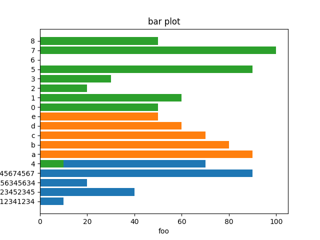
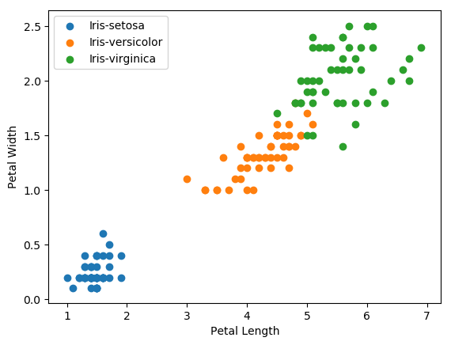
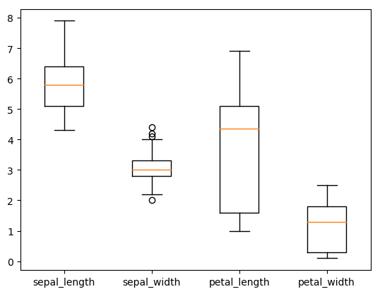
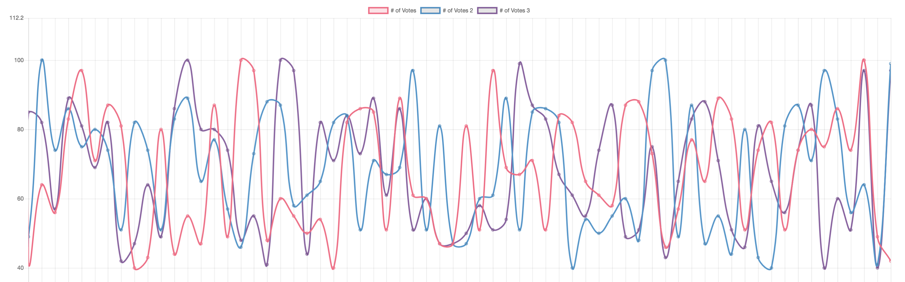
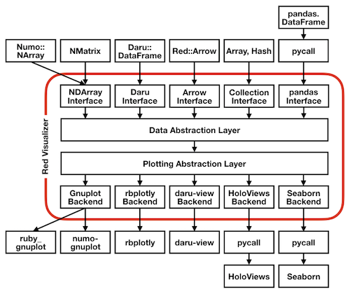
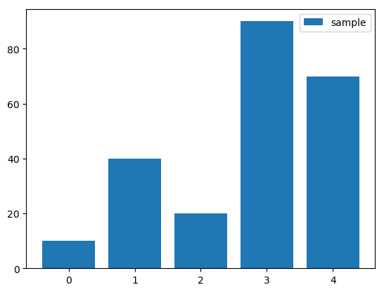

# Pragmatic Charty

## 名古屋Ruby会議04

<br>

### *[秒速亭二八四粁](https://github.com/284km)*

 

---

<center>

</center>

---

<center>

</center>

---

<center>

</center>

---

<center>

</center>

---

# 内径 35 メートル !!

<br>

<center>

</center>

---

<center>

</center>

---

## 昨夜

- ロース味噌かつ
- 手羽先
- 天むす

---

## 今朝

- 串カツ
- エビフライ
- おいしいお茶 :tea:

---

# お茶 :tea:

- 直前の発表で　joker1007 さんはお茶を濁すって言ってたけど
- 今朝のは濁っていないきれいなお茶でした

---

# 茶 :tea:

---

# 茶 `:tea:`

---

# ...... !!!

---

# "Charty"

---

([@amatsuda](https://github.com/amatsuda) says...)

---

# [red-data-tools/charty](https://github.com/red-data-tools/charty/tree/master/examples)

Visualizing your data in Ruby

---

## Visualizing your data in Ruby って

## たとえば

---



---



---



---



---

## みたいなのが簡単に出力できちゃう

---

# [red-data-tools/charty](https://github.com/red-data-tools/charty/tree/master/examples)

You need to write very few lines of code for representing what you want to do.

It lets you focus on your analysis of data, instead of plotting.

---

# [red-data-tools/charty](https://github.com/red-data-tools/charty/tree/master/examples)

### 過去の発表

Charty を知ってほしいなあ。開発者が増えたらうれしいなあ。

- RailsDM 2019
- RubyKaigi 2019 - RubyData Workshop

---

# [red-data-tools/charty](https://github.com/red-data-tools/charty/tree/master/examples)

### 今日の発表

- Charty を知ってほしいなあ
- 名古屋でも開発者が増えたらうれしいなあ
- 実用的な話もしたい  ← New!!

---

# Charty を知ってほしいなあ
# について

---

# Charty の基本情報

前提ぽいことを話すと長いので、ちょっと駆け足で説明します。

ここわからないんだけど！というのがあったら補足するので発表中でも声かけて頂いて大丈夫です！
（今日は最後までいるので発表後に聞いてくれても良いです！）

---



---

# 最近の状況を踏まえて

（RubyKaigi 2019 での発表以降、色々と開発が進んだので最新情報を説明します）

---

# Data Abstraction Layer

- Daru::DataFrame
- Numo::NArray
- NMatrix
- ActiveRecord
- benchmark_driver (Charty Adapter)

---

# Plotting Abstraction Layer

- PyPlot (matplotlib.pyplot)
- Gruff
- rubyplot
- Google Charts ← New!!
- chart.js (experimental)
- (bokeh) 実装予定
- (Plotly) よさそう。実装予定
- GR Framework (再考。薄いラッパーを用意するか）

---


---

# Simple usage

```ruby
require 'charty'
charty = Charty::Plotter.new(:pyplot)

bar_plot = charty.bar do
  series [0,1,2,3,4], [10,40,20,90,70], label: "sample"
end
bar_plot.render("sample.png")
```



---

# GitHub を見たり、デモをしながらいくつかのサンプルを紹介します

実はここにサンプルがいろいろ入っている。

https://github.com/red-data-tools/charty/tree/master/examples

---

# 名古屋でも開発者が増えたらうれしいなあ
# について

---

# 最近の Charty 開発のようすを紹介しようと思います

---

# RubyKaigi 2019 コード懇親会にて

3 人からの合計 3 つの pull request がマージまでたどり着いた。
内 2 人は OSS のコードで pull request ははじめだったとのこと :tada:

これらは自分以外の人が開発をしたから分かったモノ達である。

- [Unstrict dependency version for bundler by tomog105 · Pull Request #4 · red-data-tools/charty](https://github.com/red-data-tools/charty/pull/4)
- [Adds MacOS installation to README by Chinats · Pull Request #5 · red-data-tools/charty](https://github.com/red-data-tools/charty/pull/5)
- [Fix typo in examples/daru.rb by kantarow · Pull Request #6 · red-data-tools/charty](https://github.com/red-data-tools/charty/pull/6)

---

# RubyKaigi 2019 の翌日
# After Hack にて

実際に使っている backend を見てもらえると助かる例: Gruff
現在は Pyplot がリファレンス実装的位置づけなので(プロット可能なグラフが一番多い。などが理由)

直接話しながら背景を踏まえて一緒に開発したら捗った例と言えそう

- [add an instruction for Ubuntu + pyenv by hasumikin · Pull Request #8 · red-data-tools/charty](https://github.com/red-data-tools/charty/pull/8)
- [Add label option to series at README by yaboojp · Pull Request #9 · red-data-tools/charty](https://github.com/red-data-tools/charty/pull/9)

---

# RubyKaigi 以降、現在まで

- [Add google charts backend by indigolain · Pull Request #11 · red-data-tools/charty](https://github.com/red-data-tools/charty/pull/11)
- [Abstract plotter by kantarow · Pull Request #13 · red-data-tools/charty](https://github.com/red-data-tools/charty/pull/13)
- [Use volume mount in Dockerfile.dev by kei-s · Pull Request #15 · red-data-tools/charty](https://github.com/red-data-tools/charty/pull/15)
- [fix travis ci by katsyoshi · Pull Request #17 · red-data-tools/charty](https://github.com/red-data-tools/charty/pull/17)

あとは、コミット権を持っている人の分は書いていないけれど、裏側の設計、実装の整理が最近進行していたりします。

---

# How to development

---

# Development with Docker

(@koic さんの "海外Rubyカンファレンスへの踏み出し方" に学ぼう！)
(yn-misaki さんの 開発環境のに関する話でも言及していましたね。)

たとえば突然いつもの開発用マシンを失うことだってある。そんな時にもすぐに開発再開が可能となるのは便利。

今ならこれだけで動かせます！

```sh
$ bundle install
$ docker build -f ./Dockerfile.dev -t charty-dev:0.1 .
$ docker run -it -v ${PWD}:/charty -w /charty charty-dev:0.1 ./bin/console
irb(main):001:0> Charty::VERSION
=> "0.1.4-dev"
```

---

# 最近はどんな人が、どういうことをやっているか、という話

- Gruff
- bokeh
- Chart.js
- Plotly

---

# Ruby Association Grant のはなし

https://www.ruby.or.jp/en/news/20181106

---

# 実用的な話もしたい

---

# Gruff が古い RMagick に依存している件

- 先ほど話した、Charty が Gruff から他の何かへの移行パスになり得るという話。
    - (もし話していなかったら、ここで話します)

---

# ActiveRecord との組み合わせ

- image ファイルの場合はまあ、Gruff を置き換えるだけという感じ
- JavaScript ライブラリと組み合わせた場合はどう？
    - デモをします
- Chart.js の場合、pan とか、pinch in, out をするために hammber.js に依存している辺りがちょっと気になっている。
- react だったり、他の何らかの javascript のライブラリと組み合わせた時大丈夫なもの？
    - まだ調べられていない。知っている方がいたら教えてほしいです！
- こちらはまだ実装が無いのですが、bokeh.js や、plotly の方が本命。という感じはしています。

---

# 再びバックエンドの切り替えが楽という話

- それらが後にバックエンドとして実装されたら、バックエンドを簡単に切り替えればそのまま使えるというのも Charty のメリット
- まだしていなかったら、Plotly のおもしろそうな機能の話

---

# 284km/benchmark_driver-output-charty

$ be benchmark-driver examples/parse.yaml -o charty

---

# red-datasets を用いての例

デモしながら説明します！

---

# Future Plans

- 実用的な例を示そうと思った時、例えば他の言語やライブラリのサンプルと同様のデータセットを red-datasets に追加して、同様のこういうことはカバーしています。という見せ方ができると説得力がありそう。とここ最近考えるようになりました。
- 最近 Charty の interface を変えているせいで、rubydown との連携が壊れていると思う。直す。（スミマセン
- Charty を使えそうなところ (使うメリットがある部分で使っていく)
- Charty を導入したいとか、既存のグラフライブラリから置き換えたい。気になる。などありましたら是非気軽に声をかけてください


---

- こう書く方向に変更しようと現在考えている

```ruby
foo = Foo.where(...)
plot = Charty.bar(:price, :sales, foo, plotter: :google_chart)
plot.render
```

---

# Practicality :tea: and Continuity :tea:

- 手元のブランチで実はあるリポジトリの gruff を Charty にほぼ置き換えたやつがある。
- 少しづつ試してみて、いけそうな段階に達したら切り替えようかと

---

## Join us!

- Red Data Tools: https://red-data-tools.github.io/
- 次は 6/11(火) [OSS Gate東京ミートアップ for Red Data Tools in Speee](https://speee.connpass.com/event/131471/)
- オンラインのコミュニケーションはこちら！ [red-data-tools/ja - Gitter](https://gitter.im/red-data-tools/ja)

